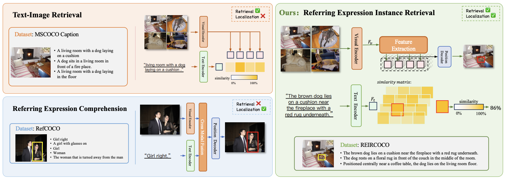

# Referring Expression Instance Retrieval and A Strong End-to-End Baseline
[🏡 Project Page](https://haoxiangzhao12138.github.io/REIR/) |  [📄 Paper](https://arxiv.org/abs/2506.18246) | [🤗 REIRCOCO Dataset](https://huggingface.co/datasets/haoxiangzhao/REIRCOCO) | 🤗 CLARE Model(coming soon)



This repository is the official implementation of the paper [Referring Expression Instance Retrieval and A Strong End-to-End Baseline](https://arxiv.org/abs/2506.18246).


## 📰 News

- Our work is accepted by **ACMMM2025**.
  
## 📝 TODO

- [x] **Dataset Released**: We have publicly released our [REIR benchmark dataset](https://huggingface.co/datasets/haoxiangzhao/REIRCOCO).
- [ ] **Training Code**: Plan to release the complete training pipeline, including data preprocessing, model architecture, and training scripts.
- [ ] **Model Weights**: Model checkpoints and pre-trained weights will be released soon.

## 💾 REIRCOCO


## 🫡 Acknowledgements

Many thanks to the code bases from [Uniext](https://github.com/MasterBin-IIAU/UNINEXT) and [open_clip](https://github.com/mlfoundations/open_clip).


## Citation

If you use this code for your research or project, please cite:

```latex
@article{hao2025referring,
  title={Referring Expression Instance Retrieval and A Strong End-to-End Baseline},
  author={Hao, Xiangzhao and Zhu, Kuan and Guo, Hongyu and Guo, Haiyun and Tang, Ming and Wang, JinQiao},
  journal={arXiv preprint arXiv:2506.18246},
  year={2025}
}
```