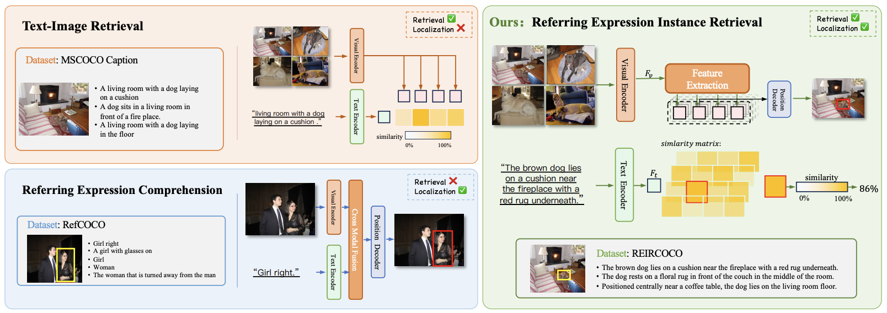
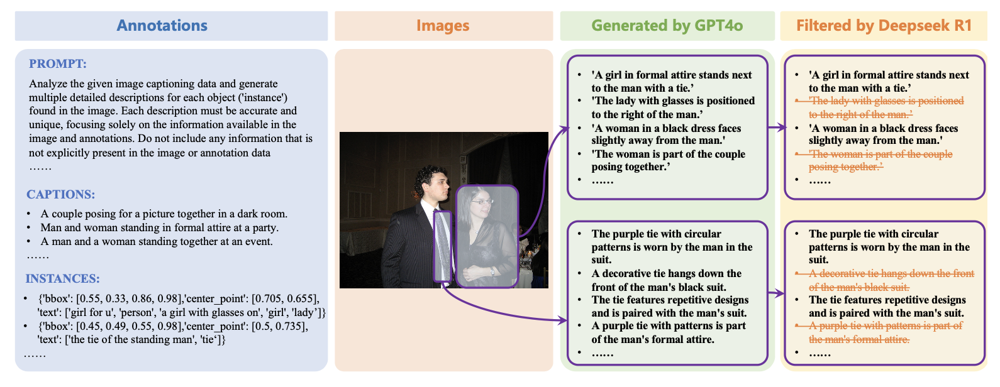
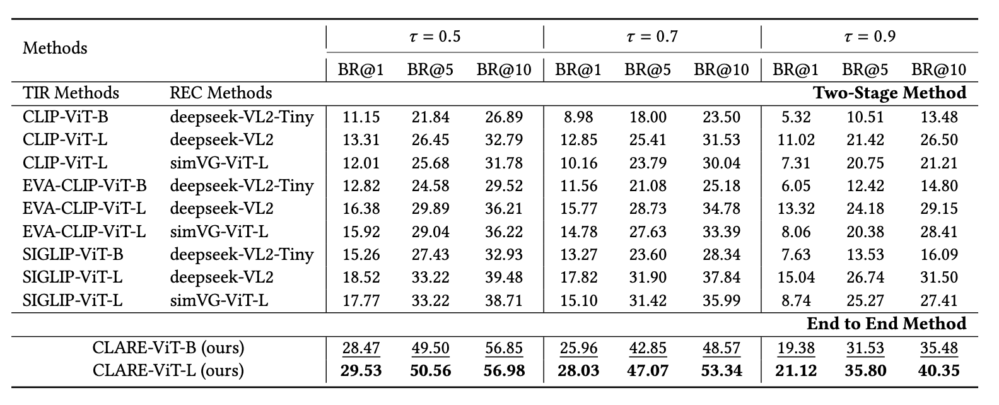
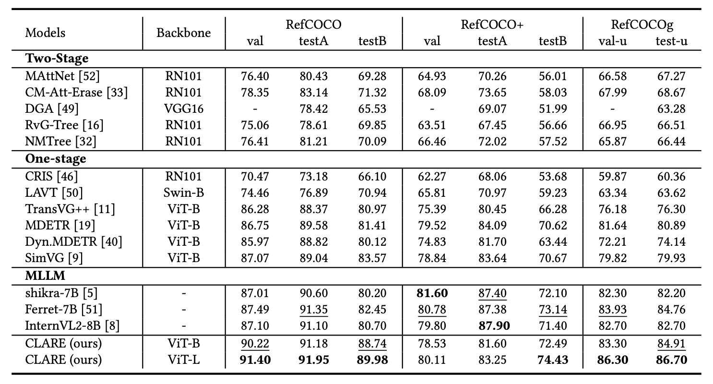
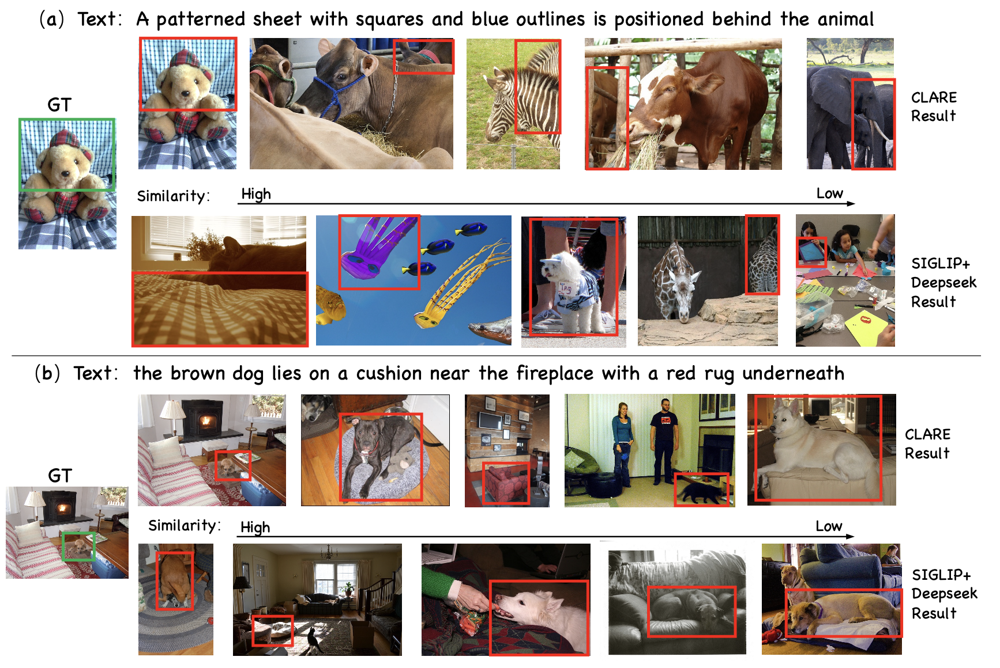

# Referring Expression Instance Retrieval and A Strong End-to-End Baseline
[🏡 Project Page](https://haoxiangzhao12138.github.io/REIR/) |  [📄 Paper](https://arxiv.org/abs/2506.18246) | [🤗 REIRCOCO Dataset](https://huggingface.co/datasets/haoxiangzhao/REIRCOCO) | 🤗 CLARE Model(coming soon)



This repository is the official implementation of the paper [Referring Expression Instance Retrieval and A Strong End-to-End Baseline](https://arxiv.org/abs/2506.18246).


## 📰 News

- Our work is accepted by **ACMMM2025**.
- **Training code released!**

## 📝 TODO

- [x] **Dataset Released**: We have publicly released our [REIR benchmark dataset](https://huggingface.co/datasets/haoxiangzhao/REIRCOCO).
- [x] **Training Code**: Complete training pipeline, including data preprocessing, model architecture, and training scripts.
- [ ] **Model Weights**: Model checkpoints and pre-trained weights will be released soon.

## 💾 REIRCOCO

REIRCOCO is a large-scale benchmark specifically designed for instance-level retrieval and localization. It features uniquely aligned referring expressions for over 215,000 object instances in 30,000+ images, totaling 613,000 fine-grained descriptions. The dataset is constructed through a two-stage pipeline: In the generation stage, GPT-4o is prompted with structured inputs—including bounding boxes, category labels, captions, and object context—to generate diverse and referentially unique expressions. In the filtering stage, DeepSeek-R1 verifies expression quality, retaining only unambiguous, grounded, and semantically accurate descriptions. This ensures that each expression matches exactly one object instance, making REIRCOCO highly suitable for both retrieval and localization tasks.

[REIRCOCO is available now!](https://huggingface.co/datasets/haoxiangzhao/REIRCOCO)

## 🔧 环境配置

### 1. 创建 Conda 环境

```bash
conda create -n clare python=3.11 -y
conda activate clare
```

### 2. 安装 PyTorch

根据你的 CUDA 版本选择对应的安装命令，以下以 CUDA 12.1 为例：

```bash
pip install torch==2.1.0 torchvision==0.16.0 --index-url https://download.pytorch.org/whl/cu121
```

> 其他 CUDA 版本请参考 [PyTorch 官网](https://pytorch.org/get-started/locally/)。

### 3. 安装 Detectron2 及项目依赖

```bash
# 克隆仓库
git clone https://github.com/haoxiangzhao12138/REIR.git && cd REIR

# 以开发模式安装 detectron2（会自动安装 fvcore, iopath, pycocotools 等依赖）
pip install -e .
```

### 4. 安装其他 Python 依赖

```bash
pip install transformers einops open_clip_torch timm scipy opencv-python scikit-image pandas seaborn
```

### 5. 编译 Deformable Attention CUDA 算子

```bash
cd projects/CLARE/clare/models/deformable_detr/ops
python setup.py build install
cd -
```

可通过以下命令验证编译是否成功：

```bash
python -c "import MultiScaleDeformableAttention as MSDA; print('MSDA OK')"
```

### 6. (可选) 下载预训练语言模型

项目默认从 `projects/CLARE/bert-base-uncased` 加载 BERT tokenizer。如果该目录不存在，可手动下载：

```bash
python -c "
from transformers import AutoTokenizer
AutoTokenizer.from_pretrained('bert-base-uncased').save_pretrained('projects/CLARE/bert-base-uncased')
"
```

### 环境验证

```bash
python -c "
import torch, detectron2, transformers, einops, open_clip, timm
print(f'PyTorch {torch.__version__}, CUDA {torch.cuda.is_available()}')
print(f'Detectron2 {detectron2.__version__}')
print('All dependencies OK')
"
```

## 📦 数据准备

在 `./datasets/` 下准备以下数据：

```
datasets/
├── coco/
│   ├── train2014/
│   ├── val2014/
│   ├── train2017/
│   ├── val2017/
│   └── annotations/
│       ├── refcoco-unc/
│       ├── refcocoplus-unc/
│       ├── refcocog-umd/
│       ├── refcoco-mixed/
│       ├── retrieval/
│       │   ├── reir_coco_train.json
│       │   └── reir_coco_test.json
│       └── cross_model_retrieval/
├── flickr30k-images/          # (可选, 用于 Phrase Grounding)
└── OpenSource/                # (可选, Flickr30k annotations)
```

- **COCO 图片**: 从 [COCO 官网](https://cocodataset.org/) 下载
- **RefCOCO/+/g 标注**: 使用 `conversion/convert_ref2coco.py` 转换
- **REIRCOCO 标注**: 从 [HuggingFace](https://huggingface.co/datasets/haoxiangzhao/REIRCOCO) 下载

## 🚀 训练

**Stage 1: 多任务预训练**
```bash
python projects/CLARE/train_net.py --num-gpus 8 \
    --config-file projects/CLARE/configs/multi_task_siglip_vit_b_base.yaml
```

**Stage 2: REIR 微调**
```bash
python projects/CLARE/train_net.py --num-gpus 8 \
    --config-file projects/CLARE/configs/rercoco_rer_siglip.yaml
```

## 📊 评测

```bash
python projects/CLARE/train_net.py --num-gpus 1 \
    --config-file projects/CLARE/configs/rercoco_rer_siglip.yaml \
    --eval-only MODEL.WEIGHTS <path-to-checkpoint>
```

## 🎞️ Results
#### REIR


#### REC


#### Visualization



## 🫡 Acknowledgements

Many thanks to the code bases from [UNINEXT](https://github.com/MasterBin-IIAU/UNINEXT) and [open_clip](https://github.com/mlfoundations/open_clip).


## Citation

If you use this code for your research or project, please cite:

```latex
@article{hao2025referring,
  title={Referring Expression Instance Retrieval and A Strong End-to-End Baseline},
  author={Hao, Xiangzhao and Zhu, Kuan and Guo, Hongyu and Guo, Haiyun and Tang, Ming and Wang, JinQiao},
  journal={arXiv preprint arXiv:2506.18246},
  year={2025}
}
```
