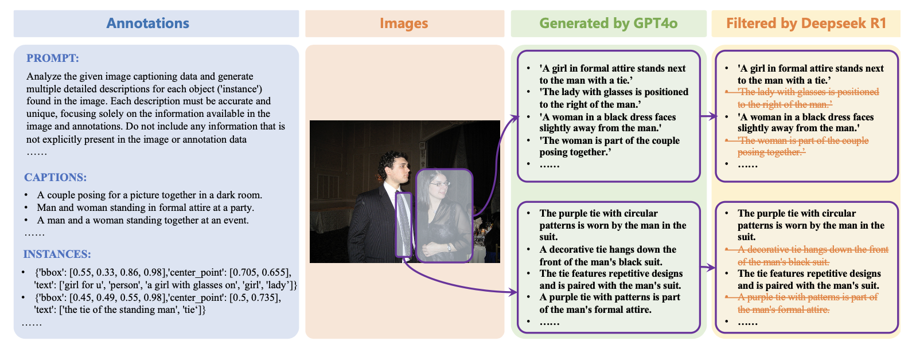

# Referring Expression Instance Retrieval and A Strong End-to-End Baseline
[🏡 Project Page](https://haoxiangzhao12138.github.io/REIR/) |  [📄 Paper](https://arxiv.org/abs/2506.18246) | [🤗 REIRCOCO Dataset](https://huggingface.co/datasets/haoxiangzhao/REIRCOCO) | 🤗 CLARE Model(coming soon)


This repository is the official implementation of the paper [Referring Expression Instance Retrieval and A Strong End-to-End Baseline](https://arxiv.org/abs/2506.18246).


## 📰 News

- Our work is accepted by **ACMMM2025**.
  
## 📝 TODO

- [x] **Dataset Released**: We have publicly released our [REIR benchmark dataset](https://huggingface.co/datasets/haoxiangzhao/REIRCOCO).
- [ ] **Training Code**: Plan to release the complete training pipeline, including data preprocessing, model architecture, and training scripts.
- [ ] **Model Weights**: Model checkpoints and pre-trained weights will be released soon.

## 💾 REIRCOCO

REIRCOCO is a large-scale benchmark specifically designed for instance-level retrieval and localization. It features uniquely aligned referring expressions for over 215,000 object instances in 30,000+ images, totaling 613,000 fine-grained descriptions. The dataset is constructed through a two-stage pipeline: In the generation stage, GPT-4o is prompted with structured inputs—including bounding boxes, category labels, captions, and object context—to generate diverse and referentially unique expressions. In the filtering stage, DeepSeek-R1 verifies expression quality, retaining only unambiguous, grounded, and semantically accurate descriptions. This ensures that each expression matches exactly one object instance, making REIRCOCO highly suitable for both retrieval and localization tasks.

[REIRCOCO is available now!](https://huggingface.co/datasets/haoxiangzhao/REIRCOCO)
## Results
#### REIR


#### REC


#### Visualization


## 🫡 Acknowledgements

Many thanks to the code bases from [Uniext](https://github.com/MasterBin-IIAU/UNINEXT) and [open_clip](https://github.com/mlfoundations/open_clip).


## Citation

If you use this code for your research or project, please cite:

```latex
@article{hao2025referring,
  title={Referring Expression Instance Retrieval and A Strong End-to-End Baseline},
  author={Hao, Xiangzhao and Zhu, Kuan and Guo, Hongyu and Guo, Haiyun and Tang, Ming and Wang, JinQiao},
  journal={arXiv preprint arXiv:2506.18246},
  year={2025}
}
```